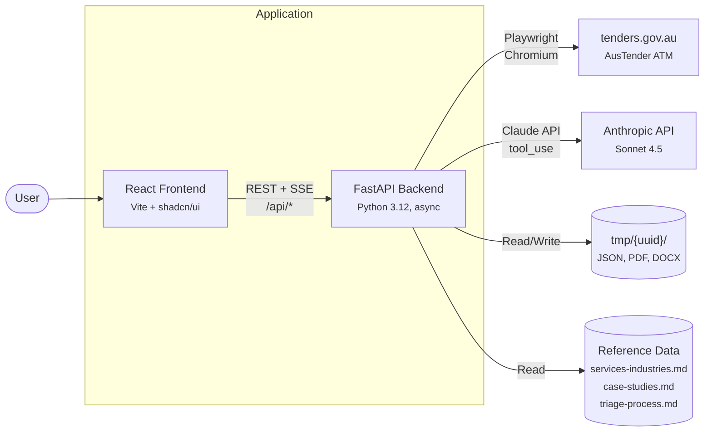
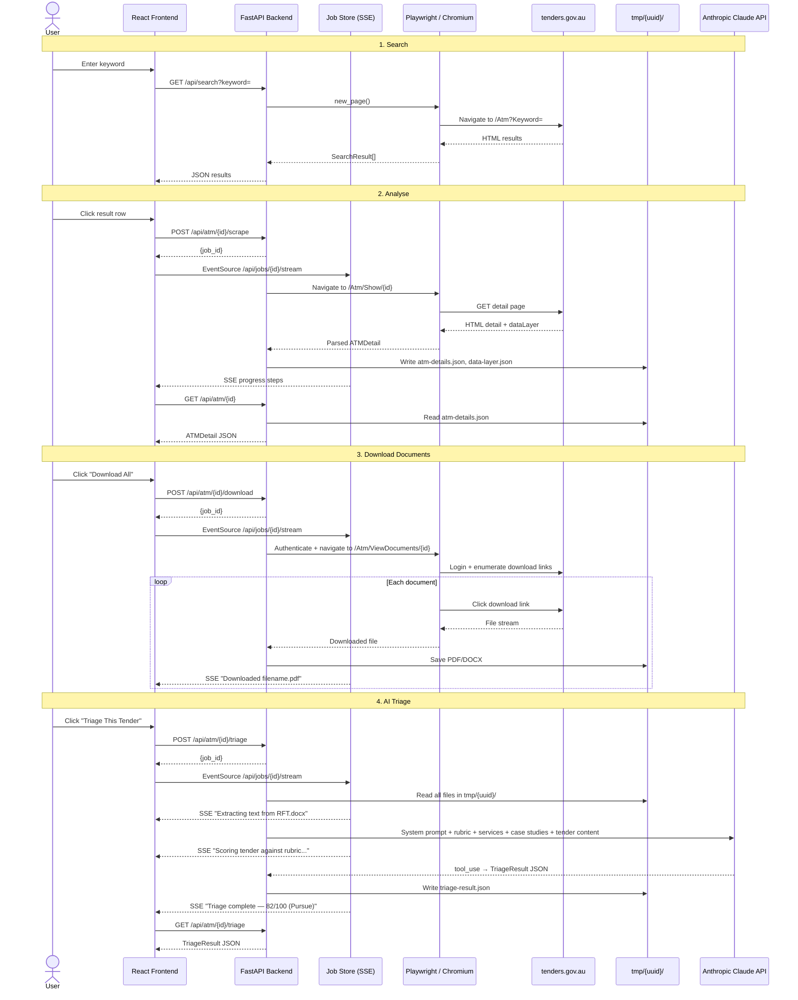
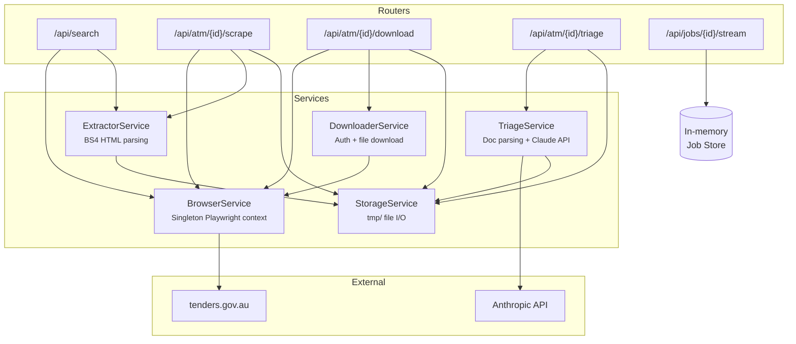

# Opportunity Analyser

A full-stack web application that searches [tenders.gov.au](https://www.tenders.gov.au/Atm) for Approach to Market (ATM) opportunities, extracts structured details via browser automation, and downloads associated documents — all through a clean React UI with real-time progress updates.

---

## Architecture

### System Context



### Request Flow



### Backend Services



---

## Tech Stack

| Layer | Technology | Rationale |
|---|---|---|
| **Backend framework** | FastAPI (Python 3.12, async) | Native async support pairs well with Playwright's async API; built-in OpenAPI docs make the API self-documenting |
| **Browser automation** | Playwright (async, Chromium) | Handles JavaScript-rendered pages, authenticated sessions, and file downloads — all things `requests`/`httpx` can't do against this site |
| **HTML parsing** | BeautifulSoup4 | Simpler and more forgiving than lxml for scraping semi-structured government HTML |
| **Data validation** | Pydantic v2 + pydantic-settings | Enforces schema at the boundary; settings load cleanly from `.env` with typed defaults |
| **Frontend framework** | React 19 + TypeScript | Type safety across the frontend; component model fits the panel-based layout |
| **Build tool** | Vite | Sub-second HMR; handles TypeScript and Tailwind without config overhead |
| **Server state** | TanStack Query (React Query) | Automatic caching, deduplication, and background refetch for API data |
| **UI state** | Zustand | Minimal boilerplate for cross-component state (selected ATM, active jobs) without prop drilling |
| **UI components** | shadcn/ui + Tailwind CSS v4 | Unstyled primitives that ship as source code — no runtime dependency, full control over markup |
| **Real-time updates** | Server-Sent Events (SSE) | One-directional server→client push is all we need for job progress; simpler than WebSockets and works through proxies |
| **AI scoring** | Anthropic Claude API (Sonnet 4.5) | Structured tool_use output for reliable JSON scoring; evaluates tender documents against capability profile and case studies |
| **Document parsing** | pdfplumber + python-docx | Extracts text from downloaded PDFs and DOCX files so the AI triage can score against actual tender content |
| **Containerisation** | Docker + nginx | Multi-stage builds keep images small; nginx handles SPA routing and reverse-proxies API/SSE to the backend |

---

## Key Design Decisions

**Singleton browser context** — Playwright launches one persistent `BrowserContext` at startup and reuses it across all requests. This avoids the 2–3 second cold-start penalty of launching a browser per request and allows session cookies to persist across analysis and download operations.

**Session persistence** — After authenticating, the browser's cookie/storage state is saved to `tmp/.auth_state.json` and restored on restart. This means the app survives restarts without forcing a re-login.

**CloudFront bypass** — The target site blocks default headless user agents via CloudFront WAF. The browser service sets a realistic Chrome user agent to avoid 403 responses.

**Offline-first testing** — The extractor is tested against saved HTML snapshots (26 tests), not the live site. This keeps tests fast, deterministic, and network-independent.

**SSE over WebSockets** — Analysis and download jobs stream progress via SSE (`EventSource` on the client). SSE is unidirectional (server→client), needs no handshake upgrade, and works natively through nginx with `proxy_buffering off`.

**Background tasks with in-memory job store** — Long-running analysis/download operations run as FastAPI `BackgroundTask`s. Progress is tracked in an in-memory dict and streamed to the client. This avoids the complexity of Celery/Redis for what is fundamentally a single-user tool.

**AI triage with structured output** — The triage service reads all files in `tmp/{uuid}/` (JSON metadata + downloaded PDFs/DOCX), extracts text, and sends it to Claude alongside Citadel Edge's capability profile and case studies. The Claude API is called with `tool_use` to guarantee a parseable `TriageResult` JSON response. Blocking I/O (document parsing, API call) runs in a thread pool via `run_in_executor` so the event loop stays free for SSE progress delivery.

---

## Quick Start (Docker)

The fastest way to run the application. Requires only **Docker** and **Docker Compose**.

### 1. Configure environment

```bash
cp backend/.env.example backend/.env
```

**PowerShell:**

```powershell
Copy-Item backend/.env.example backend/.env
```

Edit `backend/.env` with your credentials:

```
TENDERS_USERNAME=your_email@example.com
TENDERS_PASSWORD=your_password
ANTHROPIC_API_KEY=sk-ant-...
```

### 2. Build and run

```bash
docker compose up --build
```

**PowerShell:**

```powershell
docker compose up --build
```

Open [http://localhost:5173](http://localhost:5173).

This builds a single all-in-one container (frontend build → Python/Playwright + nginx) and exposes it on port `5173`. Nginx serves the React SPA and reverse-proxies `/api` and `/files` requests to uvicorn internally.

Extracted data persists on the host at `backend/tmp/` via a volume mount.

To run in the background:

```bash
docker compose up --build -d
```

**PowerShell:**

```powershell
docker compose up --build -d
```

To stop:

```bash
docker compose down
```

**PowerShell:**

```powershell
docker compose down
```

To view logs while running detached:

```bash
docker compose logs -f
```

**PowerShell:**

```powershell
docker compose logs -f
```

---

## Local Development Setup

Use this when you need hot-reload, debugger access, or want to run the browser in headed mode.

### Prerequisites

- **Python 3.12+**
- **Node.js 22+** and npm
- A registered account on [tenders.gov.au](https://www.tenders.gov.au) (for document downloads)
- An **Anthropic API key** (for AI tender triage)

### 1. Install backend dependencies

```bash
cd backend
python3 -m venv .venv
source .venv/bin/activate
pip install -r requirements.txt
playwright install chromium
playwright install-deps
```

**PowerShell:**

```powershell
cd backend
python -m venv .venv
.venv\Scripts\Activate.ps1
pip install -r requirements.txt
playwright install chromium
playwright install-deps
```

### 2. Configure environment

```bash
cp .env.example .env
```

**PowerShell:**

```powershell
Copy-Item .env.example .env
```

Edit `backend/.env` with your credentials:

```
TENDERS_USERNAME=your_email@example.com
TENDERS_PASSWORD=your_password
ANTHROPIC_API_KEY=sk-ant-...
TMP_DIR=./tmp
BROWSER_HEADLESS=true
```

- `ANTHROPIC_API_KEY` is required for the AI tender triage feature (uses Claude Sonnet 4.5)
- Set `BROWSER_HEADLESS=false` to watch the browser during development — useful for debugging selectors and login flow

### 3. Install frontend dependencies

```bash
cd frontend
npm install
```

**PowerShell:**

```powershell
cd frontend
npm install
```

### 4. Run the application

Start both services in separate terminals — the Vite dev server proxies `/api` requests to the backend automatically.

**Terminal 1 — Backend:**

```bash
cd backend
source .venv/bin/activate
python3 -m uvicorn app.main:app --host 0.0.0.0 --port 8000 --reload
```

**PowerShell:**

```powershell
cd backend
.venv\Scripts\Activate.ps1
python -m uvicorn app.main:app --host 0.0.0.0 --port 8000 --reload
```

**Terminal 2 — Frontend:**

```bash
cd frontend
npm run dev
```

**PowerShell:**

```powershell
cd frontend
npm run dev
```

Open [http://localhost:5173](http://localhost:5173) in your browser.

---

## Usage

1. **Search** — Enter a keyword (e.g. "software", "cloud") and press Enter
2. **Analyse** — Click any result row; the app automatically extracts the full ATM detail page and streams progress via SSE
3. **View details** — Once analysis completes, the right panel shows all extracted fields: agency, dates, description, conditions, contact info, etc.
4. **Download documents** — Click "Download All" in the Documents section to authenticate and download all attached PDFs/documents
5. **Triage** — After documents are downloaded, click "Triage This Tender" to run an AI-powered scoring assessment against Citadel Edge's capability profile, case studies, and a structured rubric. The triage scores the tender across four dimensions (Industry Match, Capability Match, Case Study Evidence, Differentiators) for a total out of 100, assigning a **Pursue** / **Qualify** / **No Bid** band

---

## API Endpoints

| Method | Path | Description |
|---|---|---|
| `GET` | `/api/health` | Health check |
| `GET` | `/api/search?keyword={kw}` | Search opportunities by keyword |
| `GET` | `/api/atm` | List all analysed ATM UUIDs |
| `GET` | `/api/atm/{id}` | Get extracted detail for a specific ATM |
| `POST` | `/api/atm/{id}/scrape` | Start background analysis job → returns `{job_id}` |
| `POST` | `/api/atm/{id}/download` | Start background document download → returns `{job_id}` |
| `GET` | `/api/atm/{id}/files` | List downloaded files for an ATM |
| `POST` | `/api/atm/{id}/triage` | Start AI triage scoring → returns `{job_id}` |
| `GET` | `/api/atm/{id}/triage` | Get cached triage result |
| `GET` | `/api/jobs/{id}/stream` | SSE stream of job progress |

Interactive API docs available at [http://localhost:8000/docs](http://localhost:8000/docs) (local development) or [http://localhost:5173/api/docs](http://localhost:5173/api/docs) (Docker).

---

## Testing

```bash
cd backend
python3 -m pytest tests/ -v --asyncio-mode=auto
```

**PowerShell:**

```powershell
cd backend
python -m pytest tests/ -v --asyncio-mode=auto
```

57 tests across 6 modules:
- `test_storage.py` — File I/O utilities (9 tests)
- `test_models.py` — Pydantic serialisation roundtrips (7 tests)
- `test_config.py` — Settings loading and validation (3 tests)
- `test_browser.py` — Browser launch, navigation, login flow (6 tests)
- `test_extractor.py` — Search + detail parsing against HTML fixtures (26 tests)
- `test_downloader.py` — Document download with mocked Playwright (6 tests)

---

## Project Structure

```
├── Dockerfile                   # All-in-one multi-stage build
├── docker-compose.yml           # Single-container orchestration
├── entrypoint.sh                # Starts uvicorn + nginx
├── nginx.unified.conf           # nginx config for unified container
├── backend/
│   ├── app/
│   │   ├── main.py              # FastAPI app, CORS, lifespan, routers
│   │   ├── config.py            # pydantic-settings from .env
│   │   ├── routers/             # search, atm, documents, triage, jobs (SSE)
│   │   ├── services/
│   │   │   ├── browser.py       # Singleton Playwright context + login
│   │   │   ├── extractor.py     # Search + ATM detail parsing
│   │   │   ├── downloader.py    # Authenticated document downloads
│   │   │   ├── triage.py        # AI triage scoring (document parsing + Claude API)
│   │   │   └── storage.py       # tmp/ directory + JSON file I/O
│   │   └── models/              # Pydantic schemas (ATMDetail, JobStatus, TriageResult)
│   ├── tests/                   # 57 tests with HTML fixtures
│   ├── Dockerfile               # Standalone backend image (dev)
│   └── requirements.txt
├── frontend/
│   ├── src/
│   │   ├── components/          # SearchBar, ResultsTable, ATMDetailPanel,
│   │   │                        # DocumentList, TriagePanel, JobProgress + shadcn/ui
│   │   ├── hooks/               # useSearch, useATMDetail, useJobStatus
│   │   ├── api/client.ts        # Typed axios wrapper
│   │   ├── store/appStore.ts    # Zustand state
│   │   └── types/               # TypeScript interfaces (atm.ts, triage.ts)
│   ├── Dockerfile               # Standalone frontend image (dev)
│   ├── nginx.conf               # nginx config for standalone frontend container
│   └── package.json
```
